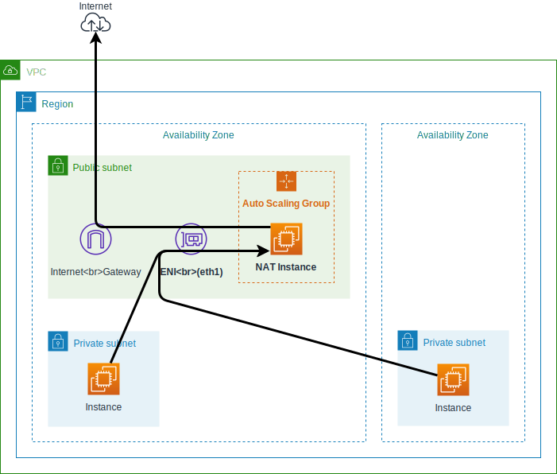

# terraform-aws-nat-instance [](https://circleci.com/gh/int128/terraform-aws-nat-instance)

Este é um módulo Terraform que provisiona uma instância NAT.

Recursos:

- Fornecimento de NAT para sub-redes privadas
- Auto cura usando um grupo de dimensionamento automático
- Economia de custos usando uma instância Spot (a partir de US $1/mês)
- Endereço IP de origem fixo por reanexação da ENI
- Suporte ao Systems Manager Session Manager
- Compatível com espaços de trabalho
- O Terraform 0.12 ou posterior é necessário.
  
**Aviso**: Em geral, você deve usar um gateway NAT. Este módulo fornece uma solução de baixo custo para fins de teste.

## Começando
Você pode usar este módulo com o módulo terraform-aws-modules/vpc/aws da seguinte forma:

```tf
module "vpc" {
  source  = "terraform-aws-modules/vpc/aws"

  name                 = "main"
  cidr                 = "172.18.0.0/16"
  azs                  = ["us-west-2a", "us-west-2b", "us-west-2c"]
  private_subnets      = ["172.18.64.0/20", "172.18.80.0/20", "172.18.96.0/20"]
  public_subnets       = ["172.18.128.0/20", "172.18.144.0/20", "172.18.160.0/20"]
  enable_dns_hostnames = true
}

module "nat" {
  source = "int128/nat-instance/aws"

  name                        = "main"
  vpc_id                      = module.vpc.vpc_id
  public_subnet               = module.vpc.public_subnets[0]
  private_subnets_cidr_blocks = module.vpc.private_subnets_cidr_blocks
  private_route_table_ids     = module.vpc.private_route_table_ids
}

resource "aws_eip" "nat" {
  network_interface = module.nat.eni_id
  tags = {
    "Name" = "nat-instance-main"
  }
}
```

Agora crie uma instância EC2 na sub-rede privada para verificar a configuração NAT.  [AWS Systems Manager Session Manager](https://docs.aws.amazon.com/systems-manager/latest/userguide/session-manager.html),  faça login na instância e certifique-se de ter acesso externo a partir da instância.

Veja também o [example](example/).

## Como funciona
Este módulo provisiona os seguintes recursos:

- Grupo de Auto Scaling com política de instâncias mistas
- Modelo de lançamento
- Interface de rede elástica
- Grupo de segurança
- Função IAM para anexo de SSM e ENI
- Rota VPC (opcional)
- Você precisa anexar seu IP elástico ao ENI.

Dê uma olhada no diagrama:



Por padrão, é usada a imagem mais recente do Amazon Linux 2. 
Você pode definir `image_id` para uma imagem personalizada.

A instância executará [`runonce.sh`](runonce.sh) e [`snat.sh`](snat.sh) para habilitar o NAT da seguinte forma:

1. Anexe o ENI ao `eth1`.
2. Defina os parâmetros do kernel para encaminhamento e masquerade IP.
3. Altere a rota padrão para `eth1`.
   

## Configuração

### User data

Você pode definir seção adicional de `write_files` e `runcmd`. Por exemplo,

```tf
module "nat" {
  user_data_write_files = [
    {
      path : "/opt/nat/run.sh",
      content : file("./run.sh"),
      permissions : "0755",
    },
  ]
  user_data_runcmd = [
    ["/opt/nat/run.sh"],
  ]
}
```

Veja também os [cloud-init modules](https://cloudinit.readthedocs.io/en/latest/topics/modules.html) e o [example](example/) para mais informações.

### Acesso SSH

Você pode habilitar o acesso SSH definindo a opção `key_name` e abrindo o grupo de segurança. Por exemplo,

```tf
module "nat" {
  key_name = "YOUR_KEY_PAIR"
}

resource "aws_security_group_rule" "nat_ssh" {
  security_group_id = module.nat.sg_id
  type              = "ingress"
  cidr_blocks       = ["0.0.0.0/0"]
  from_port         = 22
  to_port           = 22
  protocol          = "tcp"
}
```

## Guia de migração

### Atualizando para a versão 2 a partir da versão 1

Este módulo não cria mais um EIP desde a versão 2.

Para manter seu EIP quando você migra para o módulo v2, renomeie o EIP no estado da seguinte forma:

```console
% terraform state mv -dry-run module.nat.aws_eip.this aws_eip.nat
Would move "module.nat.aws_eip.this" to "aws_eip.nat"

% terraform state mv module.nat.aws_eip.this aws_eip.nat
Move "module.nat.aws_eip.this" to "aws_eip.nat"
Successfully moved 1 object(s).
```


## Contribuições
Este é um software de código aberto. Sinta-se livre para abrir problemas e solicitações de pull.

<!--terraform-docs-->
## Requisitos
Nenhum requisito.

## Provedores

| Name | Version |
|------|---------|
| aws | n/a |

## Inputs

| Name | Description | Type | Default | Required |
|------|-------------|------|---------|:--------:|
| <a name="input_enabled"></a> [enabled](#input\_enabled) | Enable or not costly resources | `bool` | `true` | no |
| <a name="input_image_id"></a> [image\_id](#input\_image\_id) | AMI of the NAT instance. Default to the latest Amazon Linux 2 | `string` | `""` | no |
| <a name="input_instance_types"></a> [instance\_types](#input\_instance\_types) | Candidates of spot instance type for the NAT instance. This is used in the mixed instances policy | `list(string)` | <pre>[<br>  "t3.nano",<br>  "t3a.nano"<br>]</pre> | no |
| <a name="input_key_name"></a> [key\_name](#input\_key\_name) | Name of the key pair for the NAT instance. You can set this to assign the key pair to the NAT instance | `string` | `""` | no |
| <a name="input_name"></a> [name](#input\_name) | Name for all the resources as identifier | `string` | n/a | yes |
| <a name="input_private_route_table_ids"></a> [private\_route\_table\_ids](#input\_private\_route\_table\_ids) | List of ID of the route tables for the private subnets. You can set this to assign the each default route to the NAT instance | `list(string)` | `[]` | no |
| <a name="input_private_subnets_cidr_blocks"></a> [private\_subnets\_cidr\_blocks](#input\_private\_subnets\_cidr\_blocks) | List of CIDR blocks of the private subnets. The NAT instance accepts connections from this subnets | `list(string)` | n/a | yes |
| <a name="input_public_subnet"></a> [public\_subnet](#input\_public\_subnet) | ID of the public subnet to place the NAT instance | `string` | n/a | yes |
| <a name="input_ssm_policy_arn"></a> [ssm\_policy\_arn](#input\_ssm\_policy\_arn) | SSM Policy to be attached to instance profile | `string` | `"arn:aws:iam::aws:policy/AmazonSSMManagedInstanceCore"` | no |
| <a name="input_tags"></a> [tags](#input\_tags) | Tags applied to resources created with this module | `map(string)` | `{}` | no |
| <a name="input_use_spot_instance"></a> [use\_spot\_instance](#input\_use\_spot\_instance) | Whether to use spot or on-demand EC2 instance | `bool` | `true` | no |
| <a name="input_user_data_runcmd"></a> [user\_data\_runcmd](#input\_user\_data\_runcmd) | Additional runcmd section of cloud-init | `list(list(string))` | `[]` | no |
| <a name="input_user_data_write_files"></a> [user\_data\_write\_files](#input\_user\_data\_write\_files) | Additional write\_files section of cloud-init | `list(any)` | `[]` | no |
| <a name="input_vpc_id"></a> [vpc\_id](#input\_vpc\_id) | ID of the VPC | `string` | n/a | yes |

## Outputs

| Name | Description |
|------|-------------|
| <a name="output_eni_id"></a> [eni\_id](#output\_eni\_id) | ID of the ENI for the NAT instance |
| <a name="output_eni_private_ip"></a> [eni\_private\_ip](#output\_eni\_private\_ip) | Private IP of the ENI for the NAT instance |
| <a name="output_iam_role_name"></a> [iam\_role\_name](#output\_iam\_role\_name) | Name of the IAM role for the NAT instance |
| <a name="output_sg_id"></a> [sg\_id](#output\_sg\_id) | ID of the security group of the NAT instance |
